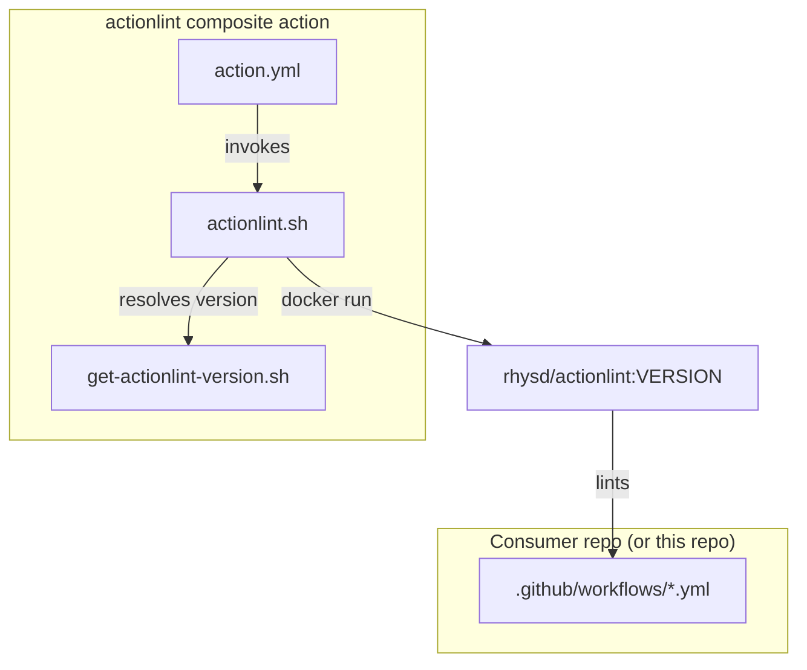
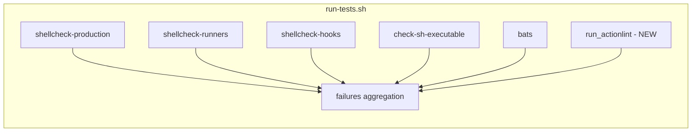
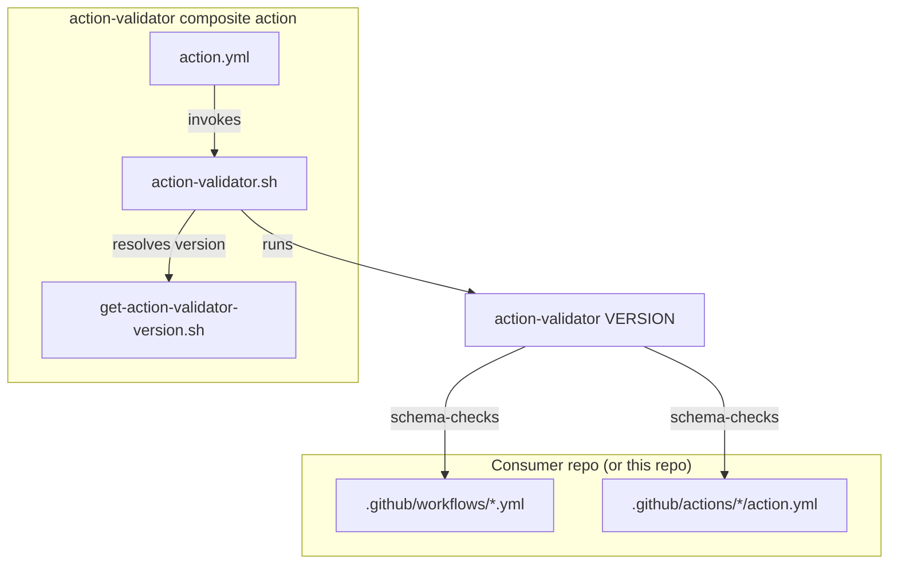
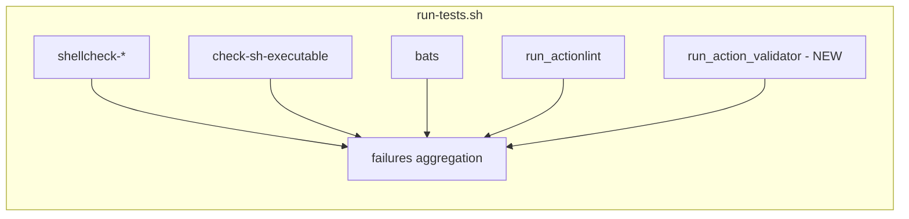
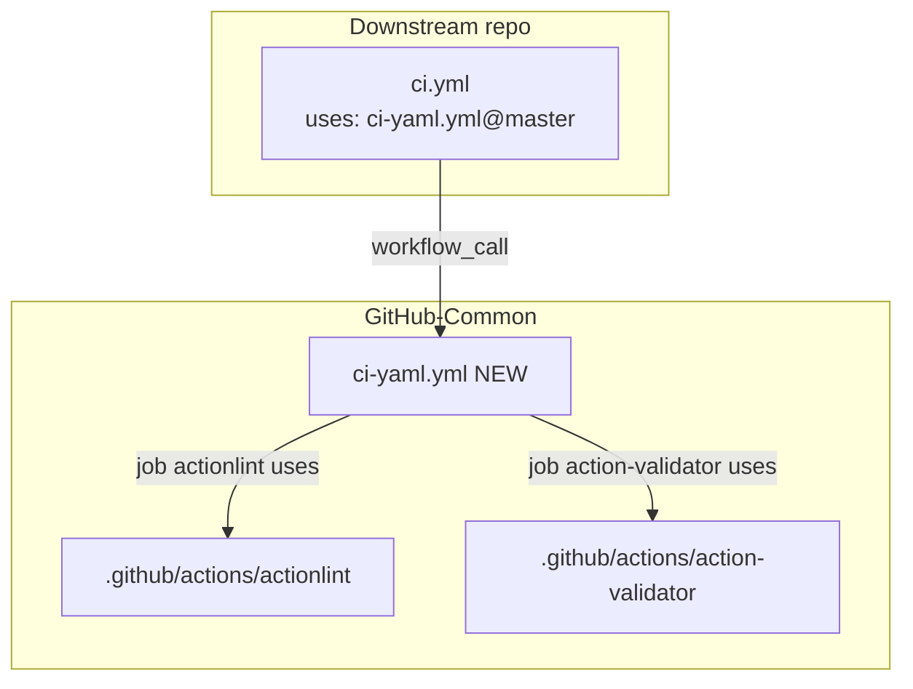

# Plan: Lint YAML workflows

Context: [problem.md](problem.md). Existing patterns to mirror:
[shellcheck-bash action](../../../.github/actions/shellcheck-bash/),
[bats version accessor](../../../.github/lib/get-bats-version.sh),
[scripts/run-tests.sh](../../../scripts/run-tests.sh),
[ci-bash.yml](../../../.github/workflows/ci-bash.yml).

## Index

- [Step 1 - Pin actionlint version](#step-1---pin-actionlint-version)
- [Step 2 - Add actionlint composite action](#step-2---add-actionlint-composite-action)
- [Step 3 - Wire actionlint into local runner](#step-3---wire-actionlint-into-local-runner)
- [Step 4 - Pin action-validator version](#step-4---pin-action-validator-version)
- [Step 5 - Add action-validator composite action](#step-5---add-action-validator-composite-action)
- [Step 6 - Wire action-validator into local runner](#step-6---wire-action-validator-into-local-runner)
- [Step 7 - Add reusable ci-yaml.yml workflow](#step-7---add-reusable-ci-yamlyml-workflow)

Note: README is updated as part of each step that changes a user-
visible surface, not as a trailing step. Lint findings surfaced
during any step are fixed in-line as part of that step. The two
tools are intentionally introduced as separate step blocks (Steps
1-3 for actionlint, Steps 4-6 for action-validator) rather than
interleaved, so each tool lands committable on its own and the
parallel structure stays visible.

## Step 1 - Pin actionlint version

Add `ACTIONLINT_VERSION` to
[.github/lib/versions.env](../../../.github/lib/versions.env) and create
`.github/lib/get-actionlint-version.sh` mirroring
[get-bats-version.sh](../../../.github/lib/get-bats-version.sh).

**Reason:** every other pinned tool in the repo flows through
`versions.env` via a dedicated getter so the composite action and the
local runner cannot drift. Reusing this pattern keeps version bumps to
a single line.

**Tests:**
- `get-actionlint-version.bats` next to the script:
  - Prints `ACTIONLINT_VERSION` from `versions.env` with no argument.
  - Echoes the override verbatim when one is passed.
  - Exits non-zero if `ACTIONLINT_VERSION` is unset (set -u behaviour).

## Step 2 - Add actionlint composite action

Create `.github/actions/actionlint/` with `action.yml` and
`actionlint.sh`. The action:

- Resolves the pinned version via
  `.github/lib/get-actionlint-version.sh`.
- Runs `actionlint` over workflow YAML under `.github/workflows/`
  (skip silently if the directory is absent, same as
  `shellcheck-bash`). Composite `action.yml` files are intentionally
  NOT passed as positional arguments - actionlint treats positional
  args as workflows and rejects the composite schema. Composite
  actions get interface-level coverage via `uses:` references in
  workflows; deep schema coverage is the job of `action-validator`
  in Steps 4-6.
- Uses the `rhysd/actionlint:<version>` Docker image. Small, pinned,
  no native install path needed in CI.

**Reason:** packaging as a composite action lets downstream repos call
it as `uses: VitaliiAndreev/GitHub-Common/.github/actions/actionlint@master`
with no Docker boilerplate at the call site, matching how
`shellcheck-bash` and `test-bats` are exposed.

**Tests:**
- `actionlint.bats` next to the script:
  - Exits 0 on a fixture workflow with no findings.
  - Exits non-zero on a fixture workflow with a known schema error
    (e.g. step missing both `run:` and `uses:`).
  - Skips silently when `.github/workflows/` does not exist.



## Step 3 - Wire actionlint into local runner

Extend [scripts/run-tests.sh](../../../scripts/run-tests.sh) with a
`run_actionlint` function, added to the `failures` aggregation block
alongside the existing shellcheck/bats checks. Function delegates to
`.github/actions/actionlint/actionlint.sh` rather than re-deriving
the docker invocation - the helper already resolves the pinned
image via the getter, and duplicating that here would create a
second source of truth.

**Reason:** the local runner is the pre-push gate; every CI check must
be reproducible locally per the existing dual-track pattern, so a
developer can fix findings without round-tripping through the remote.

**Tests:** no new unit tests for this wiring (the function is a thin
shell over the composite action's helper; coverage lives at the
helper-level bats from Step 2). Smoke-test by running
`scripts/run-tests.sh` and confirming an `=== actionlint ===` section
appears and passes.



## Step 4 - Pin action-validator version

Add `ACTION_VALIDATOR_VERSION` to
[.github/lib/versions.env](../../../.github/lib/versions.env) and create
`.github/lib/get-action-validator-version.sh` mirroring
[get-actionlint-version.sh](../../../.github/lib/get-actionlint-version.sh).

**Reason:** identical rationale to Step 1 - single source of truth
for the pinned version so the composite action and the local runner
cannot drift.

**Tests:**
- `get-action-validator-version.bats` next to the script:
  - Prints `ACTION_VALIDATOR_VERSION` from `versions.env` with no
    argument.
  - Echoes the override verbatim when one is passed.
  - Exits non-zero if `ACTION_VALIDATOR_VERSION` is unset.

## Step 5 - Add action-validator composite action

Create `.github/actions/action-validator/` with `action.yml` and
`action-validator.sh`. The action:

- Resolves the pinned version via
  `.github/lib/get-action-validator-version.sh`.
- Discovers every composite `action.yml` (and `action.yaml`) under
  `.github/actions/` at `-mindepth 2` (top-level stray ignored,
  same as the original actionlint discovery rule), plus every
  workflow file under `.github/workflows/` (action-validator
  validates both file kinds against their respective official
  schemas).
- Skips silently with `::notice::` when neither directory exists or
  no matching files are found, so consumer repos that have only
  workflows or only composite actions still work without
  configuration.
- Runs through the official action-validator distribution channel
  - either the Docker image (preferred for parity with actionlint's
    docker-only path) or `npx action-validator` as the install-free
    fallback. The helper picks one path and uses it consistently;
    the version pinning is the constant either way.

**Reason:** packaging as a composite action gives downstream repos
the same `uses: VitaliiAndreev/GitHub-Common/.github/actions/action-validator@master`
ergonomics they get from the other composite actions, with no
schema-validator boilerplate at the call site.

**Tests:**
- `action-validator.bats` next to the script:
  - Exits 0 on a fixture composite `action.yml` with a valid
    `runs.using: composite` definition.
  - Exits non-zero on a fixture composite `action.yml` with a known
    schema violation (e.g. `runs:` missing entirely, or
    `runs.using:` set to an invalid value).
  - Skips silently when neither `.github/workflows/` nor
    `.github/actions/` exists.
- The repo's own composite actions must pass under the new helper;
  any findings are fixed in-line as part of this step.



## Step 6 - Wire action-validator into local runner

Extend [scripts/run-tests.sh](../../../scripts/run-tests.sh) with a
`run_action_validator` function added to the same `failures` block,
slotted alongside `run_actionlint`. Same delegation pattern as Step
3: call the helper rather than re-deriving the invocation.

**Reason:** the composite-action surface needs the same pre-push
gate as the workflow surface; without it, a malformed `action.yml`
still only surfaces on the remote (or, worse, in a downstream
consumer's CI).

**Tests:** no new unit tests for the wiring (thin shell over the
helper). Smoke-test by running `scripts/run-tests.sh` and
confirming an `=== action-validator ===` section appears and passes
on the repo's own composite actions.



## Step 7 - Add reusable ci-yaml.yml workflow

Create `.github/workflows/ci-yaml.yml` mirroring
[ci-bash.yml](../../../.github/workflows/ci-bash.yml). Two jobs in
the same workflow:

- `actionlint` calls `./.github/actions/actionlint`.
- `action-validator` calls `./.github/actions/action-validator`.

Jobs run in parallel - independent surfaces with no ordering
constraint. `on:` triggers: `pull_request` and `workflow_call` (no
inputs needed - both composite actions self-resolve their versions).

**Reason:** keeps the bash and YAML lint surfaces in separate
workflows so a YAML-only change does not show "ci-bash" in the PR
check list, and consumers can opt in independently. Both YAML lints
ship in the same workflow so consumers get the full YAML gate from
one `uses:` line:

```yaml
jobs:
  yaml:
    uses: VitaliiAndreev/GitHub-Common/.github/workflows/ci-yaml.yml@master
```

**Tests:** validated by the very first CI run of this workflow on
this repo, which must pass (after any in-line findings from Steps
2 and 5 are fixed), otherwise the bar is set incorrectly. Document
this expectation in the workflow header comment.


