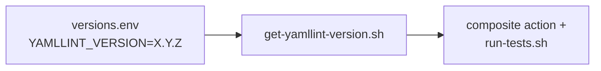
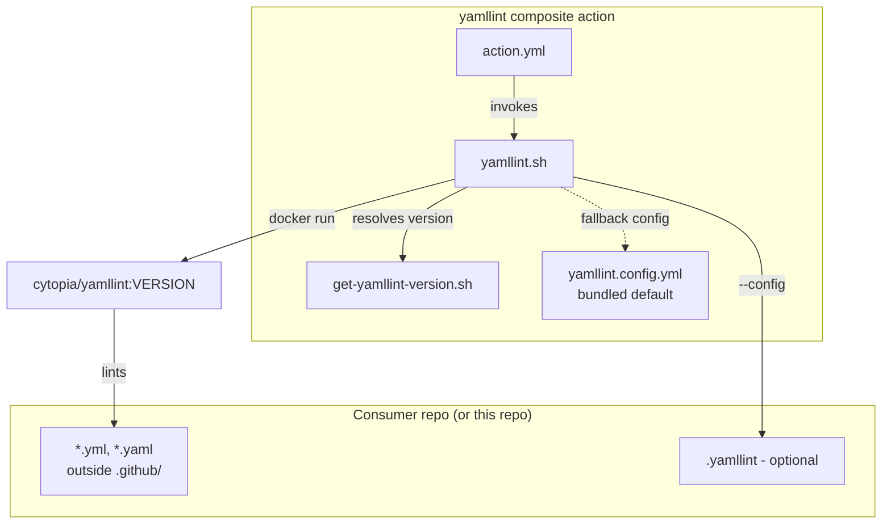
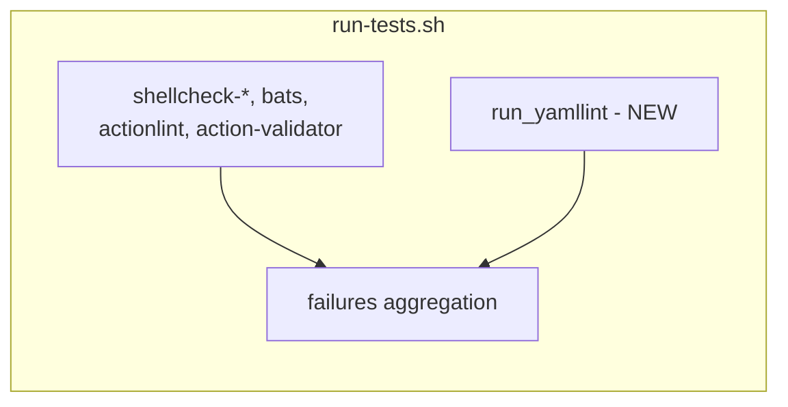
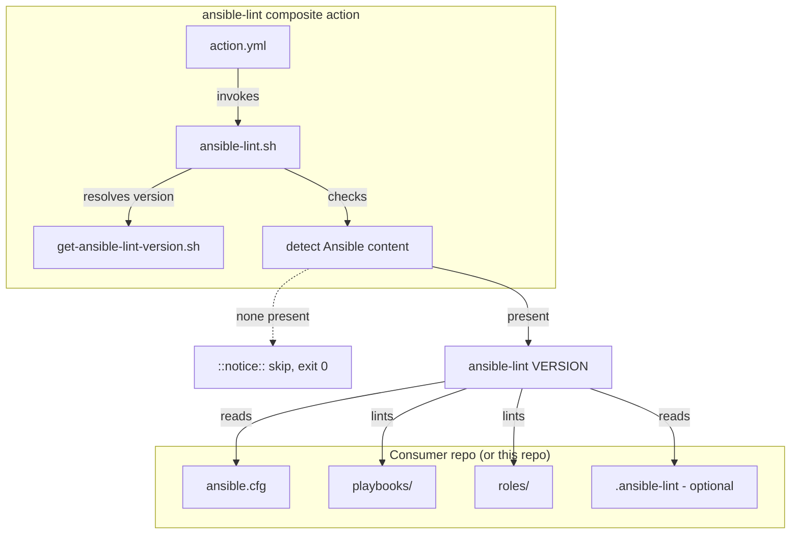
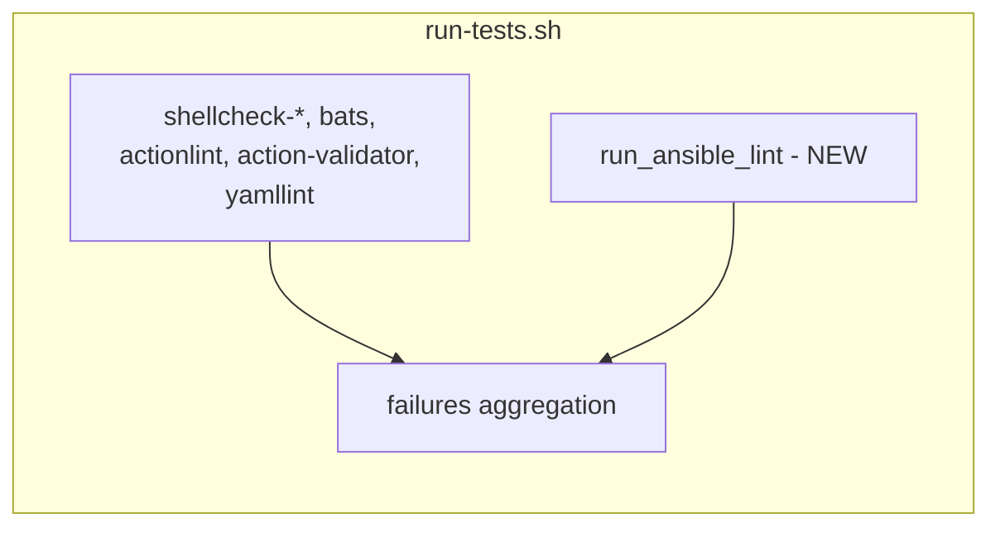
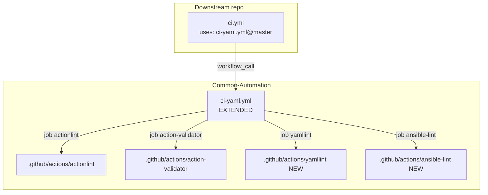

# Plan: Lint generic YAML and Ansible content

Context: [problem.md](problem.md). Patterns to mirror verbatim:

- [shellcheck-bash action](../../../.github/actions/shellcheck-bash/) - composite-action shape.
- [actionlint action](../../../.github/actions/actionlint/) - version-pinned, docker-run lint composite.
- [action-validator action](../../../.github/actions/action-validator/) - schema-validator composite, auto-skip when target absent.
- [get-actionlint-version.sh](../../../.github/lib/get-actionlint-version.sh) - version getter shape.
- [scripts/run-tests.sh](../../../scripts/run-tests.sh) - local runner wiring.
- [ci-yaml.yml](../../../.github/workflows/ci-yaml.yml) - the workflow being extended.

## Index

- [Step 1 - Pin yamllint version](#step-1---pin-yamllint-version)
- [Step 2 - Add yamllint composite action](#step-2---add-yamllint-composite-action)
- [Step 3 - Wire yamllint into local runner](#step-3---wire-yamllint-into-local-runner)
- [Step 4 - Pin ansible-lint version](#step-4---pin-ansible-lint-version)
- [Step 5 - Add ansible-lint composite action](#step-5---add-ansible-lint-composite-action)
- [Step 6 - Wire ansible-lint into local runner](#step-6---wire-ansible-lint-into-local-runner)
- [Step 7 - Extend ci-yaml.yml with the two new jobs](#step-7---extend-ci-yamlyml-with-the-two-new-jobs)

Note: README is updated as part of each step that changes a user-
visible surface, not as a trailing step. Lint findings the new tools
surface on this repo are fixed in-line as part of the step that
introduces them. The two tools are introduced as separate step
blocks (Steps 1-3 for yamllint, Steps 4-6 for ansible-lint) rather
than interleaved, mirroring feature 04's parallel structure so each
tool lands committable on its own.

---

## Step 1 - Pin yamllint version

Add `YAMLLINT_VERSION` to
[.github/lib/versions.env](../../../.github/lib/versions.env) and
create `.github/lib/get-yamllint-version.sh` mirroring
[get-actionlint-version.sh](../../../.github/lib/get-actionlint-version.sh).

**Reason:** every pinned tool in the repo flows through
`versions.env` via a dedicated getter so the composite action and
the local runner cannot drift. Same pattern as actionlint /
action-validator; no new convention introduced.

**Tests:**

- `get-yamllint-version.bats` next to the script:
  - Prints `YAMLLINT_VERSION` from `versions.env` with no argument.
  - Echoes the override verbatim when one is passed.
  - Exits non-zero if `YAMLLINT_VERSION` is unset.

---

## Step 2 - Add yamllint composite action

Create `.github/actions/yamllint/` with `action.yml` and
`yamllint.sh`. The action:

- Resolves the pinned version via
  `.github/lib/get-yamllint-version.sh`.
- Runs `yamllint` over the repo root with a curated exclude list:
  `.github/workflows/`, `.github/actions/` (covered by actionlint /
  action-validator), `.venv/`, `collections/`, `node_modules/`,
  `.git/`. The exclude list lives in the composite action so every
  consumer inherits it; per-repo overrides land via a future
  `scan-path` input if a real consumer needs one.
- Reads `.yamllint` / `.yamllint.yml` / `.yamllint.yaml` config from
  the consumer repo root if present; otherwise applies the bundled
  `default` ruleset relaxed only where the existing Common-Automation
  YAML legitimately violates it (decided in-line during this step
  after running against this repo). Any relaxation lives in a
  committed `.github/actions/yamllint/yamllint.config.yml` so the
  bar is single-sourced.
- Uses the official `cytopia/yamllint:<version>` Docker image (small,
  pinned, no native install) for parity with actionlint's
  docker-only path.
- Skips silently with `::notice::` when the repo has no `.yml` or
  `.yaml` files outside the excluded directories.

**Reason:** packaging as a composite action gives downstream repos
the same `uses: VitaliiAndreev/Common-Automation/.github/actions/yamllint@master`
ergonomics as the existing composite actions, with no
yamllint-install boilerplate at the call site.

**Tests:**

- `yamllint.bats` next to the script:
  - Exits 0 on a fixture directory of clean YAML.
  - Exits non-zero on a fixture YAML file with a known violation
    (e.g. trailing space, duplicate key).
  - Skips silently when the scanned area contains no YAML.
  - Honours a consumer-supplied `.yamllint` config (verifies the
    config-discovery path, not yamllint internals).
- The repo's own non-workflow YAML must pass under the new helper;
  any findings are fixed in-line as part of this step.

---

## Step 3 - Wire yamllint into local runner

Extend [scripts/run-tests.sh](../../../scripts/run-tests.sh) with a
`run_yamllint` function added to the `failures` aggregation block
alongside the existing checks. Function delegates to
`.github/actions/yamllint/yamllint.sh` rather than re-deriving the
docker invocation - same delegation pattern Steps 3 and 6 of
feature 04 established.

**Reason:** the local runner is the pre-push gate; every CI check
must be reproducible locally per the existing dual-track pattern,
so a developer can fix findings without round-tripping through the
remote.

**Tests:** no new unit tests for this wiring (thin shell over the
composite action's helper; coverage lives at the helper-level bats
from Step 2). Smoke-test by running `scripts/run-tests.sh` and
confirming an `=== yamllint ===` section appears and passes.

---

## Step 4 - Pin ansible-lint version

Add `ANSIBLE_LINT_VERSION` to
[.github/lib/versions.env](../../../.github/lib/versions.env) and
create `.github/lib/get-ansible-lint-version.sh` mirroring
[get-yamllint-version.sh](#step-1---pin-yamllint-version) (created
in Step 1).

**Reason:** identical to Step 1 - single source of truth for the
pinned version so the composite action and the local runner cannot
drift. ansible-lint pins its own yamllint and ansible-core minor
versions transitively; documenting that fact in `versions.env` as a
comment makes future bumps obvious.

**Tests:**

- `get-ansible-lint-version.bats` next to the script:
  - Prints `ANSIBLE_LINT_VERSION` from `versions.env` with no
    argument.
  - Echoes the override verbatim when one is passed.
  - Exits non-zero if `ANSIBLE_LINT_VERSION` is unset.

---

## Step 5 - Add ansible-lint composite action

Create `.github/actions/ansible-lint/` with `action.yml` and
`ansible-lint.sh`. The action:

- Resolves the pinned version via
  `.github/lib/get-ansible-lint-version.sh`.
- Detects Ansible content at the consumer repo root: presence of
  any of `ansible.cfg`, `playbooks/`, `roles/`. If none are present
  the action emits a `::notice::` and exits 0 - the auto-skip
  pattern problem.md commits to. This is the only auto-skip check
  in the composite; ansible-lint itself can run from a clean repo
  but emits noise we do not want on every non-Ansible CI run.
- Uses the official `ghcr.io/ansible/community-ansible-lint:<version>`
  Docker image (or, if image availability is unreliable at the
  pinned version, falls back to `pipx install ansible-lint==<version>`
  inside the runner - decided in-line during this step). The
  composite picks one path; the version pinning is the constant
  either way.
- Reads `.ansible-lint` / `.ansible-lint.yml` config from the
  consumer repo root if present; otherwise applies the bundled
  default `production` profile so consumers get the strict bar by
  default.
- Runs from the consumer repo root with no positional args -
  ansible-lint discovers playbooks and roles automatically.

**Reason:** packaging as a composite action keeps downstream wiring
to a single `uses:` line and centralises the auto-skip detection
so every consumer applies it identically. Without the composite,
each consumer would either re-implement the detection or pay the
full ansible-lint cost on every run.

**Tests:**

- `ansible-lint.bats` next to the script:
  - Exits 0 on a fixture repo with a minimal valid playbook + role.
  - Exits non-zero on a fixture playbook with a known violation
    (e.g. `command-instead-of-module`, `no-changed-when`).
  - Auto-skips with `::notice::` when none of `ansible.cfg`,
    `playbooks/`, `roles/` exist in the scanned root.
  - Honours a consumer-supplied `.ansible-lint` config.

---

## Step 6 - Wire ansible-lint into local runner

Extend [scripts/run-tests.sh](../../../scripts/run-tests.sh) with a
`run_ansible_lint` function added to the same `failures` block as
`run_yamllint`. Same delegation pattern: call the helper rather
than re-deriving the invocation. The helper's own auto-skip
detection means Common-Automation (which has no Ansible content) sees
the function exit 0 with a notice line, not a failure.

**Reason:** keeps the local runner symmetric with CI - every CI
job is reproducible locally - and gives consumer repos that vendor
this runner (e.g. via `scripts/run-tests.sh` copy or future shared
runner) the Ansible gate for free.

**Tests:** no new unit tests for the wiring (thin shell over the
helper). Smoke-test by running `scripts/run-tests.sh` and
confirming an `=== ansible-lint ===` section appears and reports
the auto-skip notice on this repo.

---

## Step 7 - Extend ci-yaml.yml with the two new jobs

Extend [.github/workflows/ci-yaml.yml](../../../.github/workflows/ci-yaml.yml)
with two additional jobs alongside `actionlint` and
`action-validator`:

- `yamllint` calls `./.github/actions/yamllint`.
- `ansible-lint` calls `./.github/actions/ansible-lint`.

Jobs run in parallel - independent surfaces with no ordering
constraint. No new inputs - both composite actions self-resolve
their versions and apply their auto-skip rules. The workflow
header comment is updated to document the four-job shape and the
auto-skip semantics so consumers reading the source understand why
`ansible-lint` runs on every consumer without configuration.

**Reason:** keeps every consumer's wiring to a single `uses:` line
on `ci-yaml.yml@master`. Splitting into `ci-ansible.yml` was
explicitly rejected in problem.md as a framework-axis category
error; this step is the realisation of that decision.

**Tests:** validated by the very first CI run of the extended
workflow on this repo, which must pass (after any findings from
Steps 2 and 5 are fixed in-line). The `ansible-lint` job must
report its auto-skip notice on this repo - if it tries to actually
lint nothing and reports success without the notice, the auto-skip
contract is wrong and gets fixed before this step ships.

**Out of scope for this step:** wiring the workflow into
`Infrastructure-VM-Ansible`'s CI. That happens as a step in that
repo's feature 02, against this feature's published `master`.

