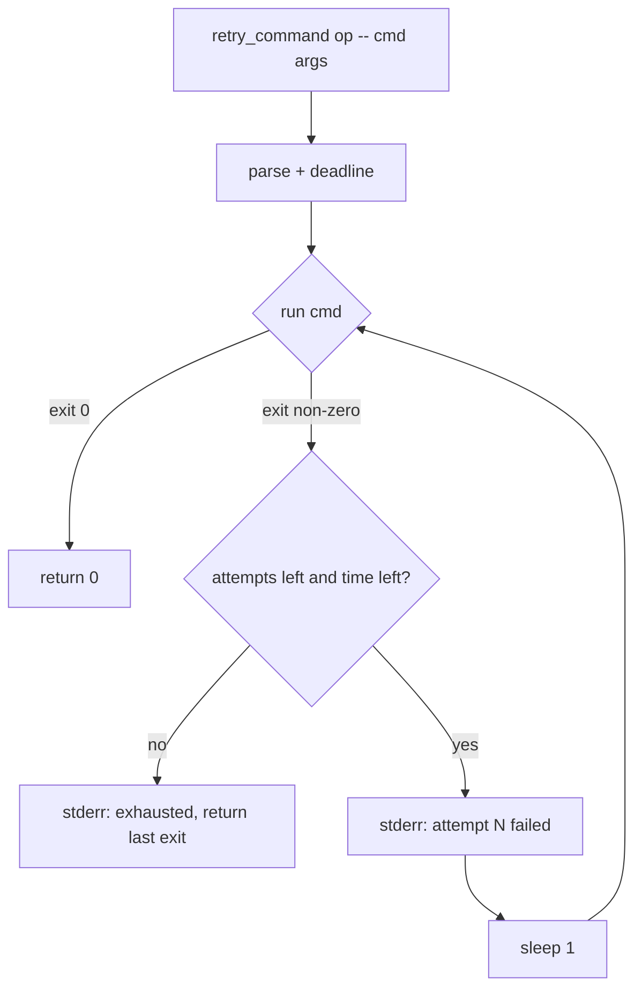
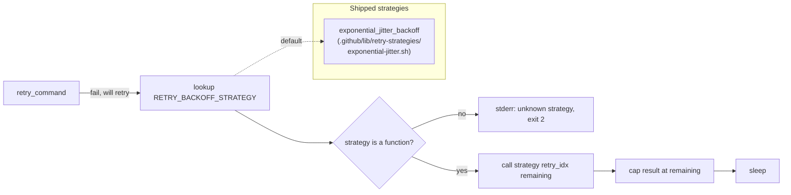
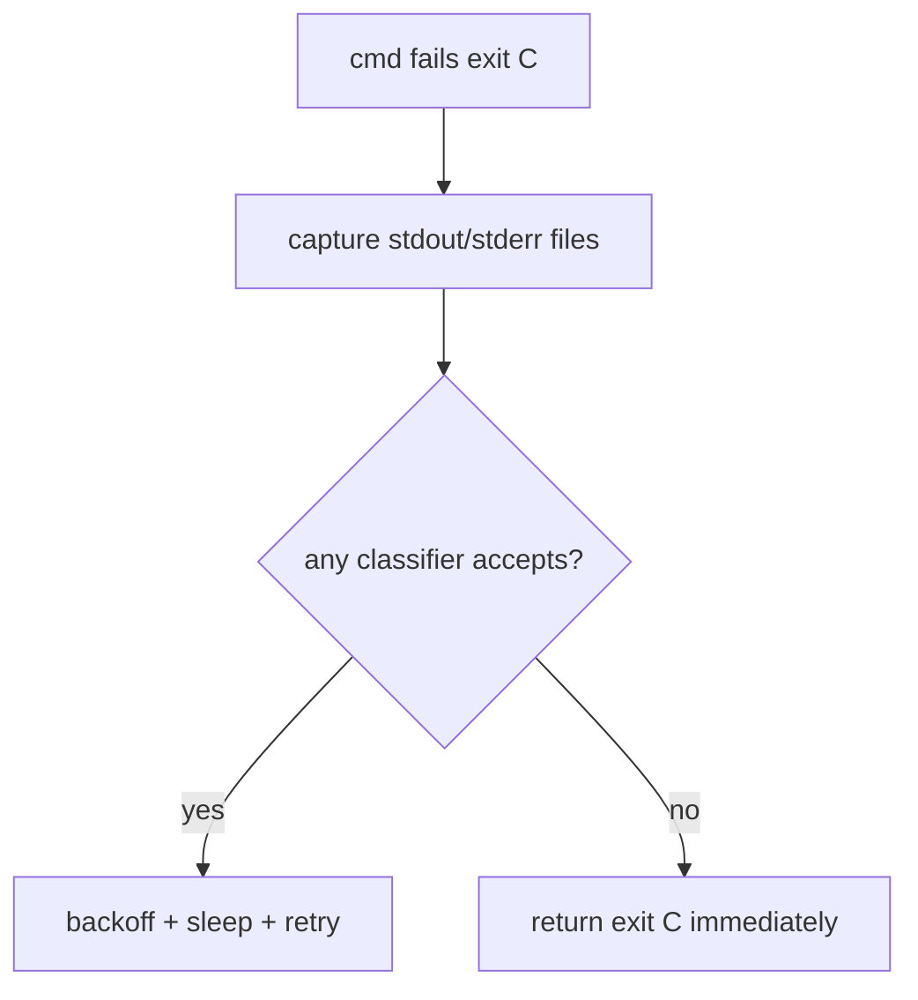
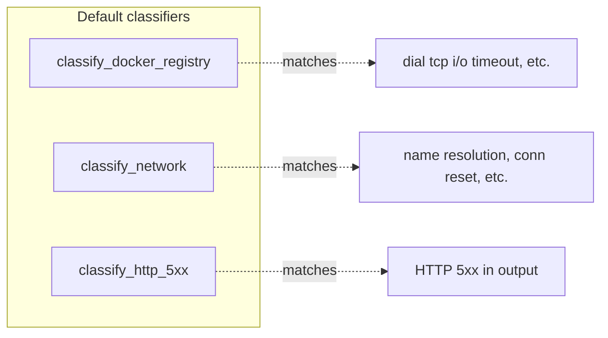
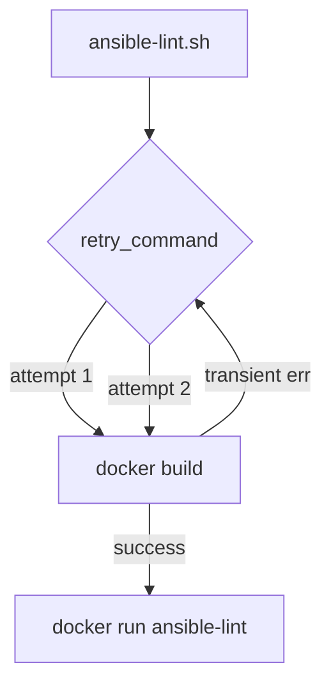
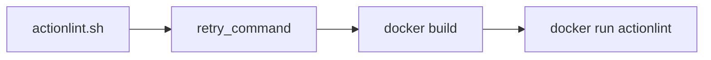
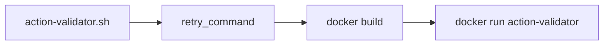

# Plan: reusable bash retry primitive

See [problem.md](problem.md) for context, locked decisions, and the
off-the-shelf survey.

## Index

- [Step 1 - Primitive core: budget enforcement](#step-1---primitive-core-budget-enforcement)
- [Step 2 - Backoff strategy: pluggable, defaulting to exponential with jitter](#step-2---backoff-strategy-pluggable-defaulting-to-exponential-with-jitter)
- [Step 3 - Classifier strategy: pluggable transient detection](#step-3---classifier-strategy-pluggable-transient-detection)
- [Step 4 - Default transient classifiers (docker, network, HTTP 5xx)](#step-4---default-transient-classifiers-docker-network-http-5xx)
- [Step 5 - Composite action wrapper](#step-5---composite-action-wrapper)
- [Step 6 - Migrate ansible-lint](#step-6---migrate-ansible-lint)
- [Step 7 - Migrate yamllint](#step-7---migrate-yamllint)
- [Step 8 - Migrate actionlint](#step-8---migrate-actionlint)
- [Step 9 - Migrate action-validator](#step-9---migrate-action-validator)

The primitive is built incrementally across steps 1-4 so each
commit ships a working version with one more axis of configurability
than the last. Steps 6-9 are deliberately separate per-action
migrations so a regression in one is bisectable. README updates are
folded into each step rather than batched at the end - every commit
ships the docs for the surface it introduces. Directories
(`.github/actions/retry/`, `Tests/actions/retry/`) are created by
the step that first puts content in them - no `.gitkeep` scaffolding.

---

## Step 1 - Primitive core: budget enforcement

**Reason:** Smallest viable retry. A working `retry_command` that
retries any non-zero exit with a fixed 1 s sleep, capped by
`RETRY_MAX_ATTEMPTS` and `RETRY_MAX_SECONDS`. Backoff and classifier
are added in steps 2 and 3 - this step proves the budget contract
and the output-passthrough contract in isolation.

**Files**

- `.github/lib/retry.sh` (new) - sourced helper exposing one function:
  `retry_command <op-name> -- <command...>`. Reads `RETRY_MAX_ATTEMPTS`
  (default `5`) and `RETRY_MAX_SECONDS` (default `300`) from env.
  Always retries on non-zero exit; fixed 1 s sleep between attempts.
  Colocated with the other production sourced helpers in `.github/lib/`.
- `.github/lib/retry.bats` (new) - bats suite for the primitive,
  colocated next to the .sh per the existing `.github/lib/` convention
  (`fix-sh-executable.bats`, `get-*-version.bats`).

**Behaviour (retry_command)**

1. Parse args: `<op-name>` (required, for diagnostic prefixing), then `--`, then the command and its args.
2. Compute deadline: `start_seconds + RETRY_MAX_SECONDS`.
3. Loop:
   1. Increment attempt counter (start at 1).
   2. Run the command, inheriting stdin/stdout/stderr from the caller (no buffering).
   3. If exit 0 → return 0.
   4. If `attempt >= RETRY_MAX_ATTEMPTS` → print `retry: <op-name> exhausted attempts (N)` to stderr, return last exit code.
   5. If `now >= deadline` → print `retry: <op-name> exhausted seconds (S)` to stderr, return last exit code.
   6. Print `retry: <op-name> attempt N failed (exit C), retrying in 1s` to stderr; `sleep 1`.

**Tests (bats)**

- Command that exits 0 on first attempt → primitive returns 0, no retry diagnostic printed.
- Command that exits non-zero N-1 times then 0 → primitive returns 0; stderr names the op N-1 times.
- Command that always exits non-zero → primitive returns the same exit code; diagnostic mentions "exhausted attempts".
- `RETRY_MAX_ATTEMPTS=1` → no retry happens; first non-zero exit propagates immediately.
- `RETRY_MAX_SECONDS=0` → no retry happens (deadline elapses immediately).
- Output preservation: command's stdout reaches caller verbatim; stderr is preserved; only primitive diagnostics carry the `retry:` prefix and go to stderr.
- Argument parsing: missing `<op-name>` → usage error (exit 2); missing `--` separator → usage error (exit 2).

**README update**

- `README.md` (modified) - add a new top-level "Retry primitive" subsection placed under the existing actions overview. Documents the `retry_command <op> -- <cmd...>` signature, `RETRY_MAX_ATTEMPTS` / `RETRY_MAX_SECONDS` env vars and their defaults, the fixed 1 s sleep, and a one-line usage example sourcing `.github/lib/retry.sh`. The subsection grows in steps 2, 3, 4, 5 as backoff / classifiers / composite land.
- No per-directory README under `.github/lib/`. The existing helpers there don't carry one; adding a stub for a single new file would be inconsistent. The top-level "Retry primitive" subsection is the user-facing surface.

---

## Step 2 - Backoff strategy: pluggable, defaulting to exponential with jitter

**Reason:** Fixed 1 s sleeps cause thundering herd during a real
incident. Exponential-with-jitter is the industry baseline (AWS SDK,
Google SRE book). Making the strategy pluggable from the start -
symmetric with the classifier registry landing in step 3 - means a
future consumer needing constant / linear / Fibonacci / decorrelated-
jitter backoff registers a function instead of forking the primitive.
The cost is a single env-var indirection.

**Files**

- `.github/lib/retry-strategies/exponential-jitter.sh` (new) -
  defines `exponential_jitter_backoff` as a standalone sourced file.
  No other content - this file is itself an example of the consumer
  strategy-registration pattern.
- `.github/lib/retry.sh` (modified) - replace fixed sleep with a
  registry call. On load, source every `*.sh` under
  `${GHCOMMON_LIB_DIR:-$(dirname "${BASH_SOURCE[0]}")}/retry-strategies/`
  so shipped strategies are available without callers having to
  source them individually. The primitive resolves the strategy via
  `RETRY_BACKOFF_STRATEGY` (default `exponential_jitter_backoff`)
  and invokes it as `"${strategy}" <retry_index> <remaining_seconds>`.
- `.github/lib/retry.bats` (modified) - registry, default-strategy
  math, custom-strategy injection, unknown-strategy error, and a
  source-of-truth case asserting `exponential_jitter_backoff` is
  defined in `retry-strategies/exponential-jitter.sh` (via
  `declare -F` + `shopt -s extdebug`).

**Strategy contract**

A backoff strategy is a shell function named `<name>_backoff` (the
suffix is convention, not enforced) with signature:

- `$1` - retry index (1 for the first retry after attempt 1 failed)
- `$2` - remaining wall-clock budget in seconds
- stdout - the sleep duration in seconds (decimal allowed)
- exit 0 on success; any non-zero is a usage error for the primitive

The primitive caps the returned value to `$2` before sleeping (no
strategy can over-run the deadline by accident).

**Default strategy: `exponential_jitter_backoff`**

- Env vars (all optional):
  - `RETRY_BACKOFF_INITIAL_SECONDS` (default `2`)
  - `RETRY_BACKOFF_MAX_SECONDS` (default `60`)
  - `RETRY_BACKOFF_MULTIPLIER` (default `2`)
  - `RETRY_BACKOFF_JITTER_RATIO` (default `0.3`, +/-30% jitter)
  - `RETRY_BACKOFF_JITTER_SEED` (test-only, deterministic sampling)
- For retry index `R`, unjittered = `min(INITIAL * MULTIPLIER^(R-1), MAX)`.
- Jittered = unjittered * `(1 + uniform(-RATIO, +RATIO))`.

**Selecting a custom strategy**

Consumer sources a file defining e.g. `my_constant_backoff()` then
sets `RETRY_BACKOFF_STRATEGY=my_constant_backoff` in the calling
env. No primitive edit needed.

**Tests (bats)**

- Default selection: unset `RETRY_BACKOFF_STRATEGY` -> primitive uses
  `exponential_jitter_backoff`.
- Default math: retry index 1 lands in [1.4, 2.6] with default
  jitter and a fixed seed; retry index 2 in [2.8, 5.2].
- `RETRY_BACKOFF_JITTER_RATIO=0` -> deterministic exponential.
- `RETRY_BACKOFF_MAX_SECONDS=5` clamps long retries before jitter.
- Backoff past the deadline is shortened to remaining time (cap is
  in the primitive, not the strategy - applies to all strategies).
- Custom strategy injection: define `const2_backoff` returning `2.000`,
  set `RETRY_BACKOFF_STRATEGY=const2_backoff`, drive retry_command
  end-to-end and confirm the primitive sleeps that constant.
- Unknown strategy: `RETRY_BACKOFF_STRATEGY=nope_backoff` ->
  primitive errors with a clear message (function-not-found) on
  the first retry, returns exit 2.
- Deterministic seed makes default-strategy jitter reproducible.

**README update**

- `README.md` "Retry primitive" subsection - replace the current
  exponential-backoff paragraph with a Strategy paragraph
  documenting:
  - the registry contract (`<name>_backoff <retry_index>
    <remaining>` -> sleep seconds; `RETRY_BACKOFF_STRATEGY`
    selects, default `exponential_jitter_backoff`).
  - the default strategy's four config env vars and formula.
  - a one-block example of registering a custom strategy in a
    sourced file.
  - the deadline-cap rule (lives in the primitive, applies to
    every strategy).

---

## Step 3 - Classifier strategy: pluggable transient detection

**Reason:** Today the primitive retries any non-zero exit. That
hides real bugs - a syntax error or 404 should propagate
immediately, not stall for the full budget. Pluggable classifiers
inspect exit code + captured stdout / stderr and decide retriable
vs permanent.

**Files**

- `.github/lib/retry.sh` (modified) - call a classifier function before deciding to retry.
- `.github/lib/retry.bats` (modified) - cases for classifier accept / reject.

**Behaviour**

- New env var: `RETRY_CLASSIFIERS` - colon-separated list of classifier function names. Each is a shell function `<name>_classify` that receives the captured exit code (`$1`), stdout file path (`$2`), and stderr file path (`$3`) and exits 0 if the failure is retriable, non-zero if permanent.
- Default value: empty - meaning "always retry" (matches step 1 behaviour). Step 4 ships default classifier names so consumers can opt in via env.
- The primitive captures the command's stdout / stderr to temp files (still tee'd to the inherited fds for live output) so classifiers can inspect them. Files cleaned up between attempts.
- "Retriable" if **any** classifier exits 0. "Permanent" if all classifiers reject (or no classifiers configured AND a strict mode env var is set - this lets consumers opt into strict permanence-by-default in future; default is the lenient "always retriable" so step-2 behaviour persists).
- Diagnostic line names which classifier matched on retry: `retry: <op> attempt N retriable via <classifier>, sleeping Ns`.

**Tests (bats)**

- No classifiers configured → behaviour identical to step 1 (always retries on non-zero).
- One classifier configured, accepts → primitive retries; diagnostic names the classifier.
- One classifier configured, rejects → primitive returns the failure immediately, no retry; diagnostic names which classifier rejected and why (its stderr).
- Two classifiers OR'd: one rejects, one accepts → retries.
- Classifier receives the captured stdout / stderr (case writes a sentinel string to stdout, classifier asserts on it).
- Live output reaches caller while capture is in progress (no swallowing).

**README update**

- `README.md` "Retry primitive" subsection - add a Classifiers paragraph documenting `RETRY_CLASSIFIERS` (colon-separated function names), the `<name>_classify` contract (`$1`=exit, `$2`=stdout path, `$3`=stderr path; exit 0 = retriable), OR-semantics across multiple classifiers, the empty-default "always retry" behaviour, and that step 4 will ship the first batch of built-in classifier names.

---

## Step 4 - Default transient classifiers (docker, network, HTTP 5xx)

**Reason:** Ship the three classifiers that cover today's known pain
so consumers do not have to author their own to get value from the
primitive. The four lint actions migrate against these in steps 6-9.

**Files**

- `.github/lib/retry-classifiers/docker-registry.sh` (new) - defines
  `classify_docker_registry`. Patterns documented in-file.
- `.github/lib/retry-classifiers/network.sh` (new) - defines
  `classify_network`.
- `.github/lib/retry-classifiers/http-5xx.sh` (new) - defines
  `classify_http_5xx`.
- `.github/lib/retry.sh` (modified) - extend the on-load sourcing
  pattern from step 2 to also source every `*.sh` under
  `${GHCOMMON_LIB_DIR:-$(dirname "${BASH_SOURCE[0]}")}/retry-classifiers/`,
  so shipped classifiers are available without callers having to
  source them individually.
- `.github/lib/retry.bats` (modified) - per-classifier cases plus a
  source-of-truth case per classifier asserting each is defined in
  its dedicated `retry-classifiers/<name>.sh` file.

**Behaviour**

Each classifier is a `*_classify` function matching its documented
patterns against the captured stderr / stdout. All patterns are case-
insensitive grep.

- `classify_docker_registry` - matches Docker / OCI registry transients:
  - `dial tcp .*: i/o timeout`
  - `dial tcp .*: connection refused`
  - `failed to do request: Head .* dial tcp`
  - `received unexpected HTTP status: 5[0-9][0-9]` (from docker pulls)
  - `TLS handshake timeout`
  - `unexpected EOF`
- `classify_network` - generic network transients:
  - `Temporary failure in name resolution`
  - `Could not resolve host`
  - `Connection timed out`
  - `Connection reset by peer`
  - `Network is unreachable`
- `classify_http_5xx` - HTTP 5xx text in tool output:
  - `HTTP/[0-9.]* 5[0-9][0-9]`
  - `Server Error: 5[0-9][0-9]`

**Tests (bats)**

Per classifier:

- Each documented pattern, presented as captured stderr → classifier accepts (exit 0).
- A clearly-permanent message (e.g. `Permission denied`, `404 Not Found`, `syntax error`) → classifier rejects (exit non-zero).
- Empty input → classifier rejects.
- End-to-end: `RETRY_CLASSIFIERS=classify_docker_registry` against a stub command that prints a docker-registry timeout and exits non-zero → primitive retries; against a stub printing `404 Not Found` → primitive returns immediately.

**README update**

- `README.md` "Retry primitive" subsection - add a table of the three built-in classifiers (`classify_docker_registry`, `classify_network`, `classify_http_5xx`) with the patterns each matches, plus a one-line recommended-default value for `RETRY_CLASSIFIERS` covering dockerised-action use (`classify_docker_registry:classify_network:classify_http_5xx`). Note that lint actions in this repo will adopt this default in steps 6-9.

---

## Step 5 - Composite action wrapper

**Reason:** Workflows that want retry semantics in YAML (rather than
in a `run:` block sourcing the primitive directly) need an action
target. The composite is a thin pass-through to the primitive,
exposing only the minimal input surface locked in problem.md.

**Files**

- `.github/actions/retry/action.yml` (new) - composite action with three inputs (`command`, `max_attempts`, `transient_patterns`) and a single `runs:` step that sources `retry.sh` and invokes `retry_command`.
- `Tests/actions/retry/retry.bats` (new) - end-to-end via the composite's underlying bash, exercising input → primitive wiring.

**Behaviour (action.yml)**

- Inputs:
  - `command` (required) - bash command string passed verbatim to `retry_command`.
  - `max_attempts` (optional, default `5`) - exported as `RETRY_MAX_ATTEMPTS`.
  - `transient_patterns` (optional, default `classify_docker_registry:classify_network:classify_http_5xx`) - exported as `RETRY_CLASSIFIERS`.
- The bash entry resolves the primitive per the locked sourcing pattern: env-var primary (`GHCOMMON_REPO_ROOT="${{ github.action_path }}/../../.."`), relative-path fallback for direct invocation (`${SCRIPT_DIR}/../../..`).
- Invokes `retry_command "$command" -- bash -lc "$command"`. The `bash -lc` lets the input be a normal one-line shell expression with pipes and redirects.

**Tests (bats)**

Composite is bash under the hood, so the suite drives the same bash
entry point with seeded inputs:

- Command succeeds first try → action exits 0.
- Command transient-fails twice then succeeds → action exits 0; primitive's diagnostic confirms 2 retries.
- Command permanently fails → action exits non-zero with the command's exit code.
- Default `transient_patterns` cover docker registry timeouts (one positive case via the seeded stub).
- Custom `transient_patterns` overrides the defaults entirely (workflow opts in).
- Missing `command` input → action errors at composite-action validation.

**README update**

- `.github/actions/retry/README.md` (new) - composite action's own README: input contract (the three inputs with defaults), one usage example as a workflow step (`uses: ./.github/actions/retry`), a "for power users" pointer to sourcing `.github/lib/retry.sh` directly when the minimal input surface is too coarse, and a link back to the top-level "Retry primitive" subsection. Includes the env-var-primary / relative-fallback sourcing pattern note for in-repo callers.
- `README.md` "Retry primitive" subsection - add a Composite action paragraph linking the new action's README and showing a one-line workflow snippet so consumers can find it.

---

## Step 6 - Migrate ansible-lint

**Reason:** First migration. The recent CI failure on
Infrastructure-VM-Ansible was this action. Wrapping `docker build`
in the primitive turns the next registry blip into a recovered run
instead of a red one.

**Files**

- `.github/actions/ansible-lint/ansible-lint.sh` (modified) - source `retry.sh` via the locked env-var-primary / relative-fallback pattern; wrap the `docker build` invocation in `retry_command "ansible-lint docker build" -- docker build ...`.
- `.github/actions/ansible-lint/ansible-lint.bats` (modified, if it exists; create otherwise) - cases for the retry path.

**Behaviour**

- Default classifiers active: `classify_docker_registry:classify_network:classify_http_5xx`.
- `docker run` (the lint invocation itself) is NOT wrapped. Lint failures are real failures, not transient.
- All other behaviour (auto-skip, config resolution, image tag pinning) unchanged.

**Tests (bats)**

- Stubbed `docker build` succeeds first try → action exits 0; primitive never retries.
- Stubbed `docker build` emits a `dial tcp ... i/o timeout` on first call and succeeds on second → action exits 0; primitive's diagnostic confirms one retry.
- Stubbed `docker build` emits `Permission denied` → action exits non-zero immediately (classifier rejects).

**README update**

- `.github/actions/ansible-lint/README.md` (modified, or new if absent) - add a one-line note that the action's `docker build` step is wrapped by [the retry primitive](../retry/README.md) with the default classifiers, plus a one-sentence explanation of what that means for the consumer (transient registry failures recover automatically; lint failures still fail fast).

---

## Step 7 - Migrate yamllint

**Reason:** Same pattern as step 6, applied to yamllint. Separate
step so a regression in either is bisectable.

**Files**

- `.github/actions/yamllint/yamllint.sh` (modified) - wrap `docker build` in `retry_command "yamllint docker build" -- ...`.
- `.github/actions/yamllint/yamllint.bats` (modified or new) - mirror cases from step 6.

**Behaviour, Tests** - mirror step 6 with yamllint's op-name.

**README update**

- `.github/actions/yamllint/README.md` - mirror the one-line retry note added in step 6 for ansible-lint.

---

## Step 8 - Migrate actionlint

**Reason:** Same pattern. Separate step for bisectability.

**Files**

- `.github/actions/actionlint/actionlint.sh` (modified) - wrap `docker build` in `retry_command "actionlint docker build" -- ...`.
- `.github/actions/actionlint/actionlint.bats` (modified or new) - mirror cases.

**Behaviour, Tests** - mirror step 6.

**README update**

- `.github/actions/actionlint/README.md` - mirror the one-line retry note added in step 6.

---

## Step 9 - Migrate action-validator

**Reason:** Last of the four. Separate step.

**Files**

- `.github/actions/action-validator/action-validator.sh` (modified) - wrap `docker build` in `retry_command "action-validator docker build" -- ...`.
- `.github/actions/action-validator/action-validator.bats` (modified or new) - mirror cases.

**Behaviour, Tests** - mirror step 6.

**README update**

- `.github/actions/action-validator/README.md` - mirror the one-line retry note added in step 6. With this step, all four lint actions document their retry behaviour and the top-level "Retry primitive" subsection (created in step 1, grown across steps 2-5) is complete - no terminal documentation step needed.

