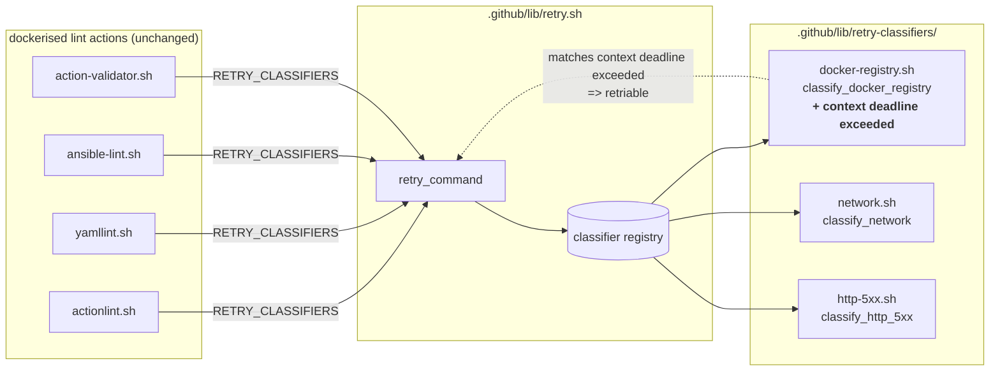

# Plan: classify Go context-deadline timeouts as Docker registry transients

See [problem.md](problem.md) for context, scope, locked decisions, and
the rationale behind extending `classify_docker_registry` rather than
adding a new classifier.

## Index

- [Step 1 - Extend classify_docker_registry with the context-deadline pattern](#step-1---extend-classify_docker_registry-with-the-context-deadline-pattern)

---

## Step 1 - Extend classify_docker_registry with the context-deadline pattern

**Reason:** The whole feature is one regex alternation plus its
coverage and documentation - splitting it would either land a test
asserting behaviour the classifier does not yet have (red CI for one
commit) or a README that advertises a pattern not yet shipped (drift).
Bundled as a single committable unit so the on-disk state stays
consistent at every commit boundary.

**Files**

- [`.github/lib/retry-classifiers/docker-registry.sh`](../../../../.github/lib/retry-classifiers/docker-registry.sh)
  (modified) - extend the regex alternation in the `grep -E -i -q` invocation with
  `context deadline exceeded`. Add the new pattern to the
  patterns-covered comment block at the top so the file's self-documentation
  stays accurate (`# - context deadline exceeded` on its own line, in
  the same shape as the existing entries).
- [`.github/lib/retry.bats`](../../../../.github/lib/retry.bats) (modified) - three new
  cases under the existing `# --- classify_docker_registry ---` block:
  - `classify_docker_registry: daemon context deadline matches` - fixture
    is the verbatim error from the
    [Infrastructure-VM-Ansible feature 02 run](https://github.com/Klark-Morrigan/Infrastructure-VM-Ansible/actions)
    that motivated the feature (`Error response from daemon: Get
    "https://registry-1.docker.io/v2/": context deadline exceeded`).
  - `classify_docker_registry: buildx context deadline matches` - fixture
    is the BuildKit / containerd surface form
    (`failed to copy: httpReadSeeker: failed open: failed to do
    request: Head ...: context deadline exceeded`) so the pattern
    is exercised against both client paths.
  - One end-to-end case under the `# --- end-to-end via retry_command ---`
    block: stub emits the daemon-side wording on first attempt, succeeds
    on second; asserts `status -eq 0`, `attempt_count -eq 2`, and the
    `retriable via classify_docker_registry` diagnostic. Mirrors the
    existing `docker-registry classifier triggers retry on registry
    timeout` case shape so reviewers compare apples-to-apples.
- [`.github/actions/retry/README.md`](../../../../.github/actions/retry/README.md)
  (modified) - the prose paragraph below the input table calls out
  "Docker / OCI registry transients" as one of the default-classifier categories. Append a
  one-line note that the registry-transient set covers Go context-deadline timeouts (the
  `context deadline exceeded` daemon/buildx wording) alongside the existing TCP/TLS/EOF
  patterns. Keeps the action README accurate without duplicating the full pattern table
  (which lives in the top-level README, modified in the same step).
- [`README.md`](../../../../README.md) (modified) - the `classify_docker_registry`
  row in the classifier table under the Retry primitive section gains
  `context deadline exceeded` as a new pattern entry, comma-separated
  alongside the existing six. No other changes - the rest of the
  table and the surrounding prose stay accurate.

**Behaviour**

The grep regex after the change:

```
dial tcp .*: i/o timeout|dial tcp .*: connection refused|failed to do request: Head .* dial tcp|received unexpected HTTP status: 5[0-9][0-9]|TLS handshake timeout|unexpected EOF|context deadline exceeded
```

Case-insensitive; both stdout and stderr scanned; everything else
about `classify_docker_registry` (call signature, return contract,
location-pin via `declare -F`) is unchanged. Callers that registered
`classify_docker_registry` in their `RETRY_CLASSIFIERS` colon list
pick the new pattern up automatically; no consumer-side edits.

**Tests**

The three bats cases above. Test coverage stays at or above its
current ratio for the classifier (the three new cases all add
positive-path assertions; the existing reject / case-insensitive /
location-pin cases continue to hold).

The locally-run `.github/lib/retry.bats` suite is the gate - one
green run before commit proves the classifier accepts both wordings
and that the retry pipeline retries on the daemon-side form. No
container or network dependency: classifier tests pipe their fixtures
through a stub via `make_capture` / `make_stub`, identical to every
other classifier test in the file.

**Diagram**



**README updates**

Bundled into this single step per the repo's per-step doc convention:

- Top-level [`README.md`](../../../../README.md) classifier table - one new pattern entry on the
  `classify_docker_registry` row.
- [`.github/actions/retry/README.md`](../../../../.github/actions/retry/README.md) - one-line note that the registry-transient
  set covers Go context-deadline timeouts.

No problem.md update - the new pattern is already documented in
[problem.md's Solution approach](problem.md#solution-approach).
